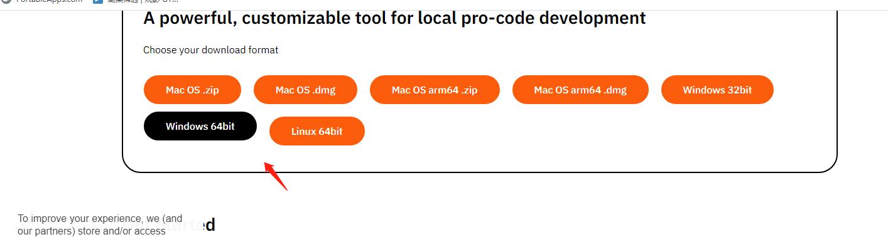
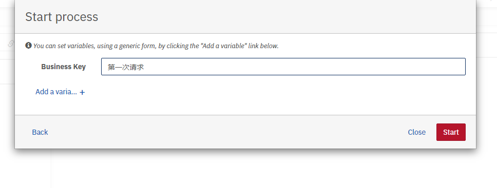
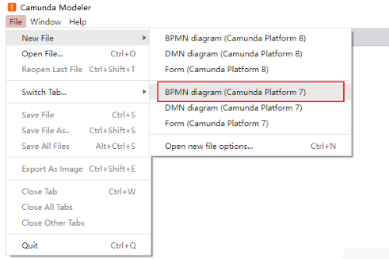

# Spring Boot 项目集成camunda流程引擎

[camunda地址](https://docs.camunda.org/manual/7.19/)

[camunda中文地址](http://camunda-cn.shaochenfeng.com/user-guide/spring-boot-integration/version-compatibility/)

> 使用camunda开源工作流引擎有：通过docker运行、使用springboot集成、部署camunda发行包、基于源代码编译运行等多种方式。
>
> 文本重点介绍如何在Spring Boot应用程序中如何集成Camunda Platform开源流程平台，这也是项目中最为常见的一种使用方式。
>
> 在本教程中，我们假设您熟悉 Java Web 应用程序开发和 Spring Boot 的基础知识。前提条件是您已经安装了 Eclipse/IDEA等Java开发工具和 Camunda Modeler流程设计器。


## 1.新建Spring Boot 项目集成camunda

首先，让我们在您选择的 IDE 中设置您的第一个流程应用程序项目。

该项目需要 Java jdk8以上版本。我本地使用的JDK版本为8，使用的开发工具IDEA2024。

### 1.1. 添加 Camunda 平台和 Spring Boot 依赖项
下一步包括为新项目设置 Maven 依赖项。需要将 Maven 依赖添加到项目的文件中。由于本示例要使用camunda流程引擎、web界面、Rest服务接口，所以需要导入camunda-bpm-spring-boot-starter-rest、camunda-bpm-spring-boot-starter-webapp依赖包。我们在“依赖管理”部分添加了 Spring Boot BOM和camunda相关依赖，这将自动将  camunda 引擎、rest服务接口和 Web 应用程序包含在应用程序中。

我们使用camunda7.19.0版本，该版本支持jdk8和springboot2。camunda和springboot版本的依赖对应关系，查看官方文档说明：[Spring Boot Version Compatibility | docs.camunda.org](https://docs.camunda.org/manual/7.19/user-guide/spring-boot-integration/version-compatibility/)


```xml
<?xml version="1.0" encoding="UTF-8"?>
<project xmlns="http://maven.apache.org/POM/4.0.0"
         xmlns:xsi="http://www.w3.org/2001/XMLSchema-instance"
         xsi:schemaLocation="http://maven.apache.org/POM/4.0.0 http://maven.apache.org/xsd/maven-4.0.0.xsd">
    <modelVersion>4.0.0</modelVersion>

    <artifactId>camunda-demo</artifactId>
    <name>camunda-demo</name>
    <groupId>com.liuhm</groupId>
    <version>1.0</version>
    <description>Demo project for Spring Boot</description>

    <properties>
        <java.version>1.8</java.version>
        <spring-boot.version>2.7.5</spring-boot.version>
        <camunda.spring-boot.version>7.19.0</camunda.spring-boot.version>
    </properties>


    <dependencyManagement>
        <dependencies>
            <dependency>
                <groupId>org.springframework.boot</groupId>
                <artifactId>spring-boot-dependencies</artifactId>
                <version>${spring-boot.version}</version>
                <type>pom</type>
                <scope>import</scope>
            </dependency>
        </dependencies>
    </dependencyManagement>

    <dependencies>
        <dependency>
            <groupId>org.camunda.bpm.springboot</groupId>
            <artifactId>camunda-bpm-spring-boot-starter-webapp</artifactId>
            <version>${camunda.spring-boot.version}</version>
        </dependency>
        <dependency>
            <groupId>org.camunda.bpm.springboot</groupId>
            <artifactId>camunda-bpm-spring-boot-starter-rest</artifactId>
            <version>${camunda.spring-boot.version}</version>
        </dependency>
        <dependency>
            <groupId>org.springframework.boot</groupId>
            <artifactId>spring-boot-starter-jdbc</artifactId>
        </dependency>
        <dependency>
            <groupId>mysql</groupId>
            <artifactId>mysql-connector-java</artifactId>
            <version>5.1.47</version>
        </dependency>
        <dependency>
            <groupId>com.sun.xml.bind</groupId>
            <artifactId>jaxb-impl</artifactId>
            <version>2.3.6</version>
        </dependency>
        <dependency>
            <groupId>org.projectlombok</groupId>
            <artifactId>lombok</artifactId>
            <version>1.18.28</version>
        </dependency>
    </dependencies>

    <build>
        <finalName>${project.artifactId}</finalName>
        <plugins>
            <plugin>
                <groupId>org.springframework.boot</groupId>
                <artifactId>spring-boot-maven-plugin</artifactId>
                <version>${spring-boot.version}</version>
            </plugin>
            <!--指定JDK编译版本 -->
            <plugin>
                <groupId>org.apache.maven.plugins</groupId>
                <artifactId>maven-compiler-plugin</artifactId>
                <configuration>
                    <source>1.8</source>
                    <target>1.8</target>
                    <encoding>UTF-8</encoding>
                </configuration>
            </plugin>
        </plugins>
    </build>

</project>
```

### 1.2. 配置 Spring Boot 项目
在项目中src/main/resources新建application.yml

让我们在文件夹中创建一个包含以下内容的文件：application.yml

**默认在mysql数据库中创建了camundatest**

```yml

spring:
  datasource:
    url: jdbc:mysql://192.168.0.154:3306/camundatest?characterEncoding=UTF-8&useUnicode=true&useSSL=false&zeroDateTimeBehavior=convertToNull&serverTimezone=Asia/Shanghai
    username: root
    password: 123456
    driver-class-name: com.mysql.jdbc.Driver

camunda:
  bpm:
    database:
      type: mysql
      schema-update: true # 是否自动建表，但我测试为true时，创建表会出现，因此还是改成false由手工建表。
    auto-deployment-enabled: false # 自动部署 resources 下的 bpmn文件
    admin-user:
      id: admin
      password: 123456
server:
  port: 8080

```

此配置将导致以下结果：

1. 将创建具有提供的密码和名字的管理员用户 admin/123456。
2. 认使用mysql数据库，启动时自动创建数据库。

### 1.3. 编写Spring Boot启动类
接下来，我们添加一个带有 main 方法的应用程序类，该方法将成为启动 Spring Boot 应用程序的入口点。该类上有@SpringBootApplication注解，它隐含地添加了几个方便的功能（自动配置、组件扫描等 - 参见 Spring Boot 文档）
```java
package com.liuhm;

import lombok.extern.slf4j.Slf4j;
import org.apache.commons.lang3.exception.ExceptionUtils;
import org.springframework.boot.SpringApplication;
import org.springframework.boot.autoconfigure.SpringBootApplication;

@SpringBootApplication
@Slf4j
public class CamundaApplication {
	public static void main(String[] args) {
		try {
			SpringApplication.run(CamundaApplication.class, args);
		}catch (Exception e){
			log.error(ExceptionUtils.getStackTrace(e));
		}
	}
}

```

### 1.4. 启动Spring Boot工程
在IDEA的maven操作窗口，执行mvn clean install命令，下载相关的第三方Jar包。

#### 1.4.1. 启动

我们的第一个 Camunda Spring Boot 应用程序现已准备就绪，此程序是一个 Spring Boot 应用程序，它作为 Web 容器、Camunda 引擎和 Camunda Web 应用程序资源嵌入到 Tomcat 中，并使用了mysql 数据库。您可以通过右键单击该类并选择CamundaApplication来运行应用程序。


#### 1.4.2. 访问

现在，在浏览器中打开 http://localhost:8080/ 时，您可以使用我们之前配置的登录名和密码“admin/123456”来访问 Camunda Web 应用程序。


能正常登录访问这个界面，表示基于springboot集成camunda成功了。

#### 1.4.3. 数据库表

数据库也创建了表


执行完成后，通过工具打开数据库控制台查看，一共有49张表。

执行的sql脚本，找到camunda-bpm-platform-7.19.0\engine\src\main\resources\org\camunda\bpm\engine\db\create文件夹下的数据库脚本，选择mysql脚本依次执行即可。


## 2.设计并部署一个BPMN流程
我们将学习如何使用camunda流程设计器设计一个BPMN2的业务流程，并部署流程。

### 2.1.下载安装流程设计器

官网下载：[Camunda Modeler官网下载(https://camunda.com/download/modeler/)](https://camunda.com/download/modeler/?spm=a2c6h.12873639.article-detail.8.50fe4252b67YFu)



直接下载地址：https://downloads.camunda.cloud/release/camunda-modeler/5.29.0/camunda-modeler-5.29.0-win-x64.zip

下载 流程设计器后camunda-modeler后，只需将下载内容解压缩到您选择的文件夹中即可。

成功解压缩后，对于 Windows 用户运行Camunda Modeler.exe，对于 Mac 用户或 Linux 用户运行.sh文件，启动流程建模器。

### 2.2. 设计BPMN流程
首先使用 Camunda Modeler 对可执行流程进行建模。设置两个人工任务节点，配置流程处理人为admin用户。


流程模型bpmn内容:

```bpmn
<?xml version="1.0" encoding="UTF-8"?>
<bpmn:definitions xmlns:bpmn="http://www.omg.org/spec/BPMN/20100524/MODEL" xmlns:bpmndi="http://www.omg.org/spec/BPMN/20100524/DI" xmlns:dc="http://www.omg.org/spec/DD/20100524/DC" xmlns:camunda="http://camunda.org/schema/1.0/bpmn" xmlns:di="http://www.omg.org/spec/DD/20100524/DI" xmlns:modeler="http://camunda.org/schema/modeler/1.0" id="Definitions_0p1akz6" targetNamespace="http://bpmn.io/schema/bpmn" exporter="Camunda Modeler" exporterVersion="5.29.0" modeler:executionPlatform="Camunda Platform" modeler:executionPlatformVersion="7.22.0">
  <bpmn:process id="test1" isExecutable="true">
    <bpmn:startEvent id="StartEvent_1">
      <bpmn:outgoing>Flow_1747ke5</bpmn:outgoing>
    </bpmn:startEvent>
    <bpmn:sequenceFlow id="Flow_1747ke5" sourceRef="StartEvent_1" targetRef="Activity_14mnow7" />
    <bpmn:userTask id="Activity_14mnow7" name="申请" camunda:assignee="admin">
      <bpmn:incoming>Flow_1747ke5</bpmn:incoming>
      <bpmn:outgoing>Flow_0t3binq</bpmn:outgoing>
    </bpmn:userTask>
    <bpmn:sequenceFlow id="Flow_0t3binq" sourceRef="Activity_14mnow7" targetRef="Activity_1ezp043" />
    <bpmn:userTask id="Activity_1ezp043" name="审批" camunda:assignee="admin">
      <bpmn:incoming>Flow_0t3binq</bpmn:incoming>
      <bpmn:outgoing>Flow_0ug1mkb</bpmn:outgoing>
    </bpmn:userTask>
    <bpmn:endEvent id="Event_110i53j">
      <bpmn:incoming>Flow_0ug1mkb</bpmn:incoming>
    </bpmn:endEvent>
    <bpmn:sequenceFlow id="Flow_0ug1mkb" sourceRef="Activity_1ezp043" targetRef="Event_110i53j" />
  </bpmn:process>
  <bpmndi:BPMNDiagram id="BPMNDiagram_1">
    <bpmndi:BPMNPlane id="BPMNPlane_1" bpmnElement="test1">
      <bpmndi:BPMNShape id="StartEvent_1_di" bpmnElement="StartEvent_1">
        <dc:Bounds x="192" y="82" width="36" height="36" />
      </bpmndi:BPMNShape>
      <bpmndi:BPMNShape id="Activity_106g3s5_di" bpmnElement="Activity_14mnow7">
        <dc:Bounds x="160" y="170" width="100" height="80" />
        <bpmndi:BPMNLabel />
      </bpmndi:BPMNShape>
      <bpmndi:BPMNShape id="Activity_1afp88w_di" bpmnElement="Activity_1ezp043">
        <dc:Bounds x="160" y="280" width="100" height="80" />
      </bpmndi:BPMNShape>
      <bpmndi:BPMNShape id="Event_110i53j_di" bpmnElement="Event_110i53j">
        <dc:Bounds x="192" y="412" width="36" height="36" />
      </bpmndi:BPMNShape>
      <bpmndi:BPMNEdge id="Flow_1747ke5_di" bpmnElement="Flow_1747ke5">
        <di:waypoint x="210" y="118" />
        <di:waypoint x="210" y="170" />
      </bpmndi:BPMNEdge>
      <bpmndi:BPMNEdge id="Flow_0t3binq_di" bpmnElement="Flow_0t3binq">
        <di:waypoint x="210" y="250" />
        <di:waypoint x="210" y="280" />
      </bpmndi:BPMNEdge>
      <bpmndi:BPMNEdge id="Flow_0ug1mkb_di" bpmnElement="Flow_0ug1mkb">
        <di:waypoint x="210" y="360" />
        <di:waypoint x="210" y="412" />
      </bpmndi:BPMNEdge>
    </bpmndi:BPMNPlane>
  </bpmndi:BPMNDiagram>
</bpmn:definitions>

```


### 2.3. 发布BPMN流程

点击流程设计器左下方的发布流程按钮：


## 3. 验证camunda流程引擎
### 3.1. 通过camunda web控制台测试
现在，当您在浏览器中打开 http://localhost:8080/camunda/app/tasklist/ 时，您可以使用我们之前配置的登录名和密码“admin/123456”来访问 Camunda Web 应用程序。




选择刚刚设计的的流程“test1”，发起一个流程实例。点击左侧“Add a simple filter”添加一个默认待办任务过滤器，就可以查看到刚刚提交的流程待办任务了。


此时，我看打开mysql数据库表，查看camunda数据库表里的数据：

#### 3.1.1. ACT_RE_DEPLOYMENT

打开流程定义发布表ACT_RE_DEPLOYMENT，看到我们刚刚发布的这个流动定义模型。


#### 3.1.2. ACT_HI_PROCINST

打开流程实例历史表ACT_HI_PROCINST，看到我们刚刚发起的这个流程实例数据。


#### 3.1.3. ACT_RU_TASK

打开流程待办任务表ACT_RU_TASK，多了一条demo用户待处理的任务。


### 3.2. 通过camunda rest接口测试
以上我们通过camunda的web界面进行了发起流程测试验证，下面我们通过Camunda REST API的方式进行测试验证。

Camunda Platform REST API官方说明文档：[Camunda Platform REST API](https://docs.camunda.org/rest/camunda-bpm-platform/7.19/)


#### 3.2.1.查询流程定义
查看流程定义rest接口：http://{host}:{port}/{contextPath}/process-definition

详细接口描述见官方文档：[Camunda Platform REST API](https://docs.camunda.org/rest/camunda-bpm-platform/7.19/#tag/Process-Definition/operation/getProcessDefinitions)

用Postman测试验证：http://localhost:8080/engine-rest/process-definition


返回json：

```json
[
    {
        "id": "test1:1:7d603a61-abc5-11ef-9172-0a0027000009",
        "key": "test1",
        "category": "http://bpmn.io/schema/bpmn",
        "description": null,
        "name": null,
        "version": 1,
        "resource": "diagram_1.bpmn",
        "deploymentId": "7d4e600f-abc5-11ef-9172-0a0027000009",
        "diagram": null,
        "suspended": false,
        "tenantId": null,
        "versionTag": null,
        "historyTimeToLive": null,
        "startableInTasklist": true
    }
]
```

#### 3.2.2. 发起流程实例
流程发起的rest接口为：http://{host}:{port}/{contextPath}/process-definition/key/{key}/start

详细接口描述见官方文档：[Camunda Platform REST API](https://docs.camunda.org/rest/camunda-bpm-platform/7.19/#tag/Process-Definition/operation/startProcessInstanceByKey)

打开postman工具进行测试验证：http://localhost:8080/engine-rest/process-definition/key/test1/start


输入json

```json
{
    "variables": {
        "variable1": {
            "value": "hello",
            "type": "String"
        },
        "variable2": {
            "value": true,
            "type": "Boolean"
        }
    },
    "businessKey": "第二次发起请求"
}
```

返回json

```json
{
    "links": [
        {
            "method": "GET",
            "href": "http://localhost:8080/engine-rest/process-instance/2f8a9efb-abc7-11ef-9172-0a0027000009",
            "rel": "self"
        }
    ],
    "id": "2f8a9efb-abc7-11ef-9172-0a0027000009",
    "definitionId": "test1:1:7d603a61-abc5-11ef-9172-0a0027000009",
    "businessKey": "第二次发起请求",
    "caseInstanceId": null,
    "ended": false,
    "suspended": false,
    "tenantId": null
}
```

#### 3.2.3. 查询待办任务
通过上面接口得知，流程当前流转到了人工节点上，那么需要查询待办任务：

查询待办任务的rest接口：http://{host}:{port}/{contextPath}/task

详细接口描述见官方文档：[Camunda Platform REST API](https://docs.camunda.org/rest/camunda-bpm-platform/7.19/#tag/Task/operation/getTasks)

用Postman测试：http://localhost:8080/engine-rest/task


返回json

```json
[
    {
        "id": "2f8bfe92-abc7-11ef-9172-0a0027000009",
        "name": "申请",
        "assignee": "admin",
        "created": "2024-11-26T15:22:26.000+0800",
        "due": null,
        "followUp": null,
        "lastUpdated": null,
        "delegationState": null,
        "description": null,
        "executionId": "2f8a9efb-abc7-11ef-9172-0a0027000009",
        "owner": null,
        "parentTaskId": null,
        "priority": 50,
        "processDefinitionId": "test1:1:7d603a61-abc5-11ef-9172-0a0027000009",
        "processInstanceId": "2f8a9efb-abc7-11ef-9172-0a0027000009",
        "taskDefinitionKey": "Activity_14mnow7",
        "caseExecutionId": null,
        "caseInstanceId": null,
        "caseDefinitionId": null,
        "suspended": false,
        "formKey": null,
        "camundaFormRef": null,
        "tenantId": null
    }
]
```

#### 3.2.4. 完成待办提交流程
完成待办任务，提交流程往下走，提交流程的rest服务接口为：

流程发起的rest接口为：http://{host}:{port}/{contextPath}/task/{id}/complete

详细接口描述见官方文档：[Camunda Platform REST API](https://docs.camunda.org/rest/camunda-bpm-platform/7.19/#tag/Task/operation/complete)

用Postman测试：http://localhost:8080/engine-rest/task/2f8bfe92-abc7-11ef-9172-0a0027000009/complete


输入json：

```json
{
    "variables": {
        "variable": {
            "value": "china"
        },
        "variable2": {
            "value": false
        }
    },
    "withVariablesInReturn": true
}
```

返回json：

```json
{
    "variable1": {
        "type": "String",
        "value": "hello",
        "valueInfo": {}
    },
    "variable2": {
        "type": "Boolean",
        "value": false,
        "valueInfo": {}
    },
    "variable": {
        "type": "String",
        "value": "china",
        "valueInfo": {}
    }
}
```

### 3.3. 通过Java API接口测试
上面介绍了通过Camunda Web控制台界面和Camunda提供的rest接口两种方式，来调用流程引擎服务。以下介绍第三种方式，即Java编码方式，直接调用Camunda提供的Service接口。

我们自己开发一个RestController服务类，类里注入RuntimeService和TaskService的SpringBean，然后调用这两个类的API接口，实现发起流程和查询待办的逻辑。
```java
import org.camunda.bpm.engine.RuntimeService;
import org.camunda.bpm.engine.TaskService;
import org.camunda.bpm.engine.impl.persistence.entity.TaskEntity;
import org.camunda.bpm.engine.runtime.ProcessInstance;
import org.camunda.bpm.engine.task.Task;
import org.springframework.web.bind.annotation.*;

import javax.annotation.Resource;
import java.util.List;

@RestController
@RequestMapping
public class TestController {
    @Resource
    private RuntimeService runtimeService;
    @Resource
    private TaskService taskService;
    /**
     * 通过流程定义key，发起一个流程实例
     * @param processKey 流程定义key
     * @return 流程实例ID
     */
    @GetMapping(value = "/startProcessInstanceByKey/{processKey}")
    public String startProcessInstanceByKey(@PathVariable("processKey") String processKey) {
        ProcessInstance instance = runtimeService.startProcessInstanceByKey(processKey);
        return instance.getRootProcessInstanceId();
    }

    /**
     * 查询某个用户的待办任务
     * @param assignee 用户ID
     * @return 待办任务列表
     */
    @GetMapping(value = "/getTaskByAssignee/{assignee}")
    public String getTaskByAssignee(@PathVariable("assignee") String assignee) {
        List<TaskEntity> taskList = (List)taskService.createTaskQuery().taskAssignee(assignee).list();
        StringBuffer sb = new StringBuffer();
        for (Task task : taskList) {
            String taskTitle = "待办任务ID="+task.getId()+",流程实例ID="+task.getProcessInstanceId()+"\n";
            System.out.println(taskTitle);
            sb.append(taskTitle);
        }
        return sb.toString();
    }
}
```

重启启动Springboot程序，调用刚刚开发的流程接口进行测试。

发起一个流程实例：http://localhost:8080/startProcessInstanceByKey/test1


执行成功，返回了流程实例ID，接着查询用户admin的待办任务：

http://localhost:8080/getTaskByAssignee/admin


## 4. 绘制流程图介绍

### 4.1. **绘制**

新建一个



我这边稍微画了一个，具体怎么画，就不在细说了，最后效果如下，模拟了个OA的流程


### 4.2. 任务分类

只介绍最常用的两种

- **用户任务 （User Task）**


具体来说就是需要手动执行的任务，即需要我们这变写完业务代码后，调用代码

```java
taskService.complete(taskId, variables);
```

才会完成的任务

- **系统任务（Service Task）**


系统会自动帮我们完成的任务

### 4.3. **网关**

分为这么几类，会根据我们传入的流程变量及设定的条件走


- **排他网关（exclusive gateway）**

这个网关只会走一个，我们走到这个网关时，会从上到下找第一个符合条件的任务往下走

- **并行网关（Parallel Gateway）**

这个网关不需要设置条件，会走所有的任务

- **包含网关（Inclusive Gateway）**

这个网关会走一个或者多个符合条件的任务

示例


如上图包含网关，需要在网关的连线初设置表达式 condition，

参数来自于流程变量

两个参数：

```
switch2d 、 switch3d
```

如果 都为true，则走任务1，3

如果 switch2d 为true switch3d为false，则只走任务1

如果 switch3d 为true switch2d为false，则只走任务3

如果都为false，则直接走网关，然后结束

## 5. 任务相关API介绍

基于service的查询类，都可先构建一个 query，然后在附上查询条件，实例几个

```
List<ProcessDefinition> list = repositoryService.createProcessDefinitionQuery().list();
List<Task> list = taskService.createTaskQuery().taskAssignee("zhangsan").list();
List<ProcessInstance> instances = runtimeService.createProcessInstanceQuery().listPage(1, 10);
```

### 5.1. **查询历史任务**

```
List<HistoricProcessInstance> list = historyService.createHistoricProcessInstanceQuery().list();
```

### 5.2. **查询当前任务/分页**

```
List<Task> list = taskService.createTaskQuery().orderByTaskCreateTime().desc().list();
```

### 5.3. **任务回退**

大体思路是拿到当前的任务，及当前任务的上一个历史任务，然后重启

代码示例

```
 Task activeTask = taskService.createTaskQuery()
        .taskId(taskId)
        .active()
        .singleResult();
List<HistoricTaskInstance> historicTaskInstance = historyService.createHistoricTaskInstanceQuery()
        .processInstanceId(instanceId)
        .orderByHistoricActivityInstanceStartTime()
        .desc()
        .list();

List<HistoricTaskInstance> historicTaskInstances = historicTaskInstance.stream().filter(v -> !v.getTaskDefinitionKey().equals(activeTask.getTaskDefinitionKey())).toList();

Assert.notEmpty(historicTaskInstances, "当前已是初始任务！");
HistoricTaskInstance curr = historicTaskInstances.get(0);

runtimeService.createProcessInstanceModification(instanceId)
        .cancelAllForActivity(activeTask.getTaskDefinitionKey())
        .setAnnotation("重新执行")
        .startBeforeActivity(curr.getTaskDefinitionKey())
        .execute();
```

### 5.4.  流程变量

包括流程中产生的变量信息，包括控制流程流转的变量，网关、业务表单中填写的流程需要用到的变量等。很多地方都要用到

#### **流程变量变量传递**

变量最终会存在 `act_ru_variable` 这个表里面

在绘制流程图的时候，如果是用户任务（`userService`） 可以设置变量，比如执行人，

写法有这么几种方式

- 写死，就比如 zhangsan
- 表达式，比如上面写的 ${user}，这种需要传入参数，其实就是启动参数的时候传入，传入参数，可选值为一个`Map<String, Object>`，之后的流程可查看次参数，上面写的是 user， 所以map里面的key需要带着user，不然会报错。

关于扩展变量，可在流程图绘制这么设定，传递方式还是一样，流程图里面在下面写：


代码：

```
ProcessInstance instance = runtimeService.startProcessInstanceByKey(key, new HashMap<>());
```

#### **变量设置**

```
runtimeService.setVariable(instance.getId(), Constants.PATIENT_ID, relatedId);
```

#### **变量查询**

```
Object variable = runtimeService.getVariable(instance.getId(), Constants.GENERAL_ID);
```

#### **历史变量查询**

```
HistoricVariableInstance variableInstance = historyService.createHistoricVariableInstanceQuery().processInstanceId(bo.getId().toString()).variableName(Constants.PATIENT_ID).singleResult();
//变量值
variableInstance.getValue();
//变量名称
variableInstance.getName();
```

### 5.5. 针对后端来说任务类型主要有两种。

#### 用户任务-userTask

即需要用户参与的任务，因为工作流执行过程中需要涉及到审批、过审之类的需要用户参与的任务，这个时候需要用户参与，然后调用接口完成任务。

#### 服务任务-serviceTask

即自动执行的任务，比如用户提交后，系统自动存储、修改状态等自动完成的任务。

**Type**

任务类型是关键，可根据配型配置实现调用 java的方法，spring 的bean方法，等等有这么几种类型

##### **Delegate Expression **推荐使用 -- 

在系统任务中，因为是自动执行，所以实际应用中需要嵌入各种业务逻辑，可以在流程图设计中，按照下面方式调用java代码执行，在spring中配置同名的bean


配置表达式，可以实现JavaDelegate接口使用类名配置，快捷写法如下，比较推荐下面这种，此种可灵活配置bean和spring结合使用，注入service等业务方法

```java
@Bean("t17")
JavaDelegate t17() {
    return execution -> {
        Map<String, Object> variables = execution.getVariables();
        Task task = taskService.createTaskQuery().processInstanceId(execution.getProcessInstanceId()).singleResult();
        //业务逻辑
        task.setOwner(String.valueOf(dentistId));
    };
}
```

**Java Class ：**

配置java类名，需要实现JavaDelegate接口，注意是全路径名，不可以使用Spring的bean配置！！！

```java
@Component
public class T17Delegate implements JavaDelegate {
 
    @Override
    public void execute(DelegateExecution execution) throws Exception {
            String taskId = execution.getId();
            String instanceId = execution.getProcessInstanceId();
            Map<String, Object> variables = execution.getVariables();
    }
}
```

下面两种可使用spring的配置

##### **Expression：**

EL表达式，调用java类的方法 ，规范：

> ```
> expression="#{monitorExecution.execution(execution)}"
> ```

```
@Component("monitorExecution")
public class MonitorExecution {
    public void execution(DelegateExecution execution){
        String processInstanceId = execution.getProcessInstanceId();
    }
}
```

### 5.6.监听器 

#### 任务监听器 - Task Listener

任务监听器用于在某个与任务相关的事件发生时执行自定义Java逻辑或表达式。它只能作为用户任务的子元素添加到流程定义中。请注意，这也必须作为BPMN 2.0扩展元素的子级和Camunda命名空间中发生，因为任务侦听器是专门为Camunda引擎构建的。

适用场景：

```java
@Bean
TaskListener t21() {
    return delegateTask -> {

        String taskId = delegateTask.getId();
        String instanceId = delegateTask.getProcessInstanceId();
        
        Map<String, Object> variables = delegateTask.getVariables();
        // TODO: 20log/3/22
        delegateTask.setVariable("", "");
    };
}
```

#### 执行监听器 - Execution Listener

执行侦听器在流程执行过程中发生某些事件时执行外部Java代码或计算表达式。可以用在任何任务中，可以捕获的事件有：

- 流程实例的开始和结束。
- 进行过渡。
- 活动的开始和结束。
- 网关的开始和结束。
- 中间事件的开始和结束。
- 结束开始事件或开始结束事件

适用场景：每个任务结束时设置任务进度

```java
public class ExampleExecutionListenerOne implements ExecutionListener {

   public void notify(DelegateExecution execution) throws Exception {
     execution.setVariable("variableSetInExecutionListener", "firstValue");
     execution.setVariable("eventReceived", execution.getEventName());
   }
}
```

### 5.7. 扩展属性- Extension properties

扩展属性适用于很多自定义的业务属性，比如设置业务流程进度


### 5.8. 流程权限及创建人设置

`IdentityService`为鉴权相关服务，但是我们实际开发中，一般会用到我们自己的鉴权系统，所以可以使用camunda提供的api来设置，具体可以看`IdentityServiceImpl`这个类，其中也是使用了ThreadLocal来保存鉴权信息 ，代码在下面

```java
private ThreadLocal<Authentication> currentAuthentication = new ThreadLocal<Authentication>();
```

用户信息设置：

```java
// Userutil是我们自己封装的用户工具类
identityService.setAuthenticatedUserId(UserUtil.getUserId().toString());
 
//获取
Authentication authentication = identityService.getCurrentAuthentication();
```

他内置很多比如开启流程时候，会默认找当前登录的人，这个类`DefaultHistoryEventProducer`

```java
// set super process instance id
ExecutionEntity superExecution = executionEntity.getSuperExecution();
if (superExecution != null) {
  evt.setSuperProcessInstanceId(superExecution.getProcessInstanceId());
}

//state
evt.setState(HistoricProcessInstance.STATE_ACTIVE);

// set start user Id
evt.setStartUserId(Context.getCommandContext().getAuthenticatedUserId());
```

### 5.9.任务执行人及发起人设置

```java
//根据任务id设置执行人
taskService.setAssignee(task.getId(), UserUtil.getUserId().toString());
```

[博客地址](https://liuhm.blog.csdn.net/article/details/144138159)

[代码下载](https://gitee.com/liuhaomin/publicdemo)

下面的camunda-demo
