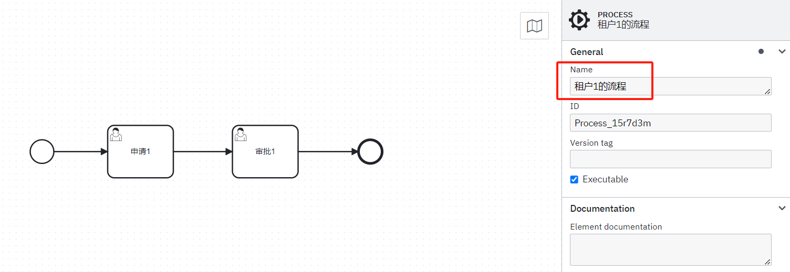

# camunda多租户实现流程

## 简介

多租户考虑的是单个 Camunda 安装应该为多个租户提供服务的情况。对于每个租户，应做出一定的隔离保证。例如，一个租户的流程实例不应干扰另一租户的流程实例。

多租户可以通过三种不同的方式实现。一种方法是每个租户使用[一个流程引擎](https://docs.camunda.org/manual/7.19/user-guide/process-engine/multi-tenancy/)。另一种方法是仅使用一个流程引擎并将数据与[租户标识符](https://docs.camunda.org/manual/7.19/user-guide/process-engine/multi-tenancy/#one-process-engine-per-tenant)相关联。第三种[采用多数据源，动态切换数据连接](https://liuhm.blog.csdn.net/article/details/138650997)。这三种方式在数据隔离级别、维护工作量和可扩展性方面有所不同


## 1. 多租户架构一：具有租户标识符的单进程引擎

多租户可以通过一个使用租户标识符（即租户ID）的流程引擎来实现。所有租户的数据存储在一张表中（相同的数据库和模式）。隔离是通过存储在列中的租户标识符来提供的。


租户标识符在部署上指定，并传播到从部署创建的所有数据（例如，流程定义、流程实例、任务等）。为了访问特定租户的数据，流程引擎允许通过租户标识符过滤查询或为命令指定租户标识符（例如，创建流程实例）。此外，流程引擎与允许省略租户标识符的身份服务结合提供透明的访问限制。

请注意，并非所有 API 都实现了透明的租户分离。例如，使用部署 API，租户可以为另一个租户部署流程。因此，直接向租户公开此类 API 端点不是受支持的用例。自定义访问检查逻辑应该构建在 Camunda API 之上，否则存在通过API接口访问其他租户数据的安全问题。

通过以下示例演示如何对共享流程引擎使用多租户。你将了解到：

- 如何使用租户 ID 部署流程定义
- 如何从具有租户 ID 的流程定义启动流程实例
- 如何通过 Camunda Web 应用程序使用多租户

### 1.1.设计一个流程并以租户发布

打开流程设计器，设计一个流程，并以tenant1租户发布



发布流程，注意填写租户ID为tenant1


发布成功后，我们打开camunda的数据库表，查看表里的记录，发现流程定义表act_re_procdef和流程部署表act_re_deployment中的TENANT_ID_字段都有了值。


### 1.2. 在流程控制台添加租户

打开浏览器并转到http://localhost:8080/camunda/app/cockpit，使用demo/demo登录。

找到租户管理菜单：

进入租户管理界面，添加2个租户，分别命名为tenant1和tenant2：


打开camunda的数据库租户表act_id_tenant，查看表里的记录，发现多了租户记录：

打开camunda的数据库租户表act_id_tenant_member，查看表里的记录，该表记录了租户和用户的关系：


接着，进入用户管理界面，添加1个用户张三，并把用户张三分配给租户tenant1，即在tenant1租户下有1个张三用户：


### 1.3. 通过租户下的用户发起流程

切换到 Cockpit 并使用新用户张三登录，点击右上角发起流程，即以tenant1发起一个流程。

发起流程后，可以设置待办任务task过滤器，只查看tenant1租户的待办任务：


这时，我们再参考一下camnuda的数据库表中数据，看看是否带有租户ID的标识。

流程待办任务表act_ru_task中的TENANT_ID_字段中写入了tenant1值：


流程历史实例表act_hi_procinst中的TENANT_ID_字段中也写入了tenant1值：


### 1.4. 通过API查询租户数据

特定于租户的数据的流程引擎查询（例如，部署查询、流程定义查询）允许按一个或多个租户标识符进行过滤。如果未设置标识符，则结果包含所有租户的数据。

要查找特定租户的部署，必须将租户标识符传递tenantIdIn到DeploymentQuery.

```java
List<Deployment> deployments = repositoryService
.createDeploymentQuery()
.tenantIdIn("tenant1", "tenant2")
.orderByTenantId()
.asc()
.list();
```

要通过为多个租户部署的流程定义的键创建实例，必须将租户标识符传递给[ProcessInstantiationBuilder](https://docs.camunda.org/manual/7.19/reference/javadoc/org/camunda/bpm/engine/runtime/ProcessInstantiationBuilder.html) 。

```java
runtimeService
.createProcessInstanceByKey("key")
.processDefinitionTenantId("tenant1")
.execute();
```

**这样，通过这个示例验证了具有共享流程引擎租户标识符的多租户模式，即通过数据库字段标识租户ID，部署一个流程实例和一个数据库实现多租户的架构。但这样的多租户架构有几个弊端：**

1. **单表数据量大的情况下，性能问题如何解决？**
2. **多个租户的数据都在一个表里，通过API可查询到，通过数据库管理工具也可查询，数据安全如何解决？**
3. **涉及到个性化定义，如何解决？**

**要解决以上问题，需要采用每个租户一个流程引擎和数据Schemas的架构。**

## 2. 多租户架构二: 多流程实例和数据schema独立架构


多租户可以通过为每个租户提供一个流程引擎来实现。每个流程引擎被配置为使用连接租户数据的不同数据源。租户的数据可以存储在不同的数据库中，可以存储在具有不同架构的一个数据库中，也可以存储在具有不同表的一个架构中。

官方文档：https://docs.camunda.org/manual/7.19/user-guide/process-engine/multi-tenancy/

## 3. 多租户架构三: 多数据源切换数据schema独立架构（重点）

**[可以学习一下DynamicRoutingDataSource 改造](https://liuhm.blog.csdn.net/article/details/138650997)**


多租户可以通过租户id去动态的切换数据源，以达到数据库隔离级别

pom新增

```xml
    <dependency>
            <groupId>com.baomidou</groupId>
            <artifactId>dynamic-datasource-spring-boot-starter</artifactId>
            <version>4.2.0</version>
        </dependency>
        <dependency>
            <groupId>com.alibaba</groupId>
            <artifactId>transmittable-thread-local</artifactId>
            <version>2.14.3</version>
        </dependency>
```

新增

### TenantConsts

```java
public class TenantConsts {

    /**
     * 主租户
     */
    public final static String MAIN_TENANT_ID = "000000";
}

```

### TenantAutoConfiguration

```java
@Configuration
public class TenantAutoConfiguration {

    @Autowired
    private DynamicDataSourceProperties properties;
    @Bean
    public DataSource dataSource(List<DynamicDataSourceProvider> providers) {
        SmDynamicRoutingDataSource dataSource = new SmDynamicRoutingDataSource(providers);
        dataSource.setPrimary(properties.getPrimary());
        dataSource.setStrict(properties.getStrict());
        dataSource.setStrategy(properties.getStrategy());
        dataSource.setP6spy(properties.getP6spy());
        dataSource.setSeata(properties.getSeata());
        dataSource.setGraceDestroy(properties.getGraceDestroy());
        return dataSource;
    }
}
```

### TenantContextHolder

```java

/**
 * saas 上下文 Holder
 */
public class TenantContextHolder {
    /**
     * 当前租户编号
     */
    private static final ThreadLocal<String> TENANT_ID = new TransmittableThreadLocal<>();


    /**
     * 获得租户编号。
     *
     * @return 租户编号
     */
    public static String getTenantId(){
        return TENANT_ID.get();
    }


    /**
     * 获得租户编号。如果不存在，则抛出 NullPointerException 异常
     *
     * @return 租户编号
     */
    public static String getRequiredTenantId(){
        String tenantId = getTenantId();
        if (tenantId == null) {
            throw new NullPointerException("TenantContextHolder 不存在租户编号！");
        }
        return tenantId;
    }

    public static void setTenantId(String tenantId){
        TENANT_ID.set(tenantId);
    }

    public static void clear(){
        TENANT_ID.remove();
    }

}

```

### SmDynamicRoutingDataSource

```java

import com.baomidou.dynamic.datasource.DynamicRoutingDataSource;
import com.baomidou.dynamic.datasource.creator.DataSourceProperty;
import com.baomidou.dynamic.datasource.creator.DefaultDataSourceCreator;
import com.baomidou.dynamic.datasource.provider.DynamicDataSourceProvider;
import com.baomidou.dynamic.datasource.spring.boot.autoconfigure.DynamicDataSourceProperties;
import com.baomidou.dynamic.datasource.toolkit.DynamicDataSourceContextHolder;
import com.liuhm.tenant.consts.TenantConsts;
import lombok.extern.slf4j.Slf4j;
import org.slf4j.MDC;
import org.springframework.beans.BeanUtils;
import org.springframework.beans.factory.annotation.Value;
import org.springframework.context.annotation.Lazy;

import javax.annotation.Resource;
import javax.sql.DataSource;
import java.util.List;

/**
 * @ClassName：SmDynamicRoutingDataSource
 * @Description: TODO
 * @Author: liuhaomin
 * @Date: 2024/5/9 8:44
 */
@Slf4j
public class SmDynamicRoutingDataSource extends DynamicRoutingDataSource {
    @Override
    public DataSource determineDataSource() {
        String tenantId = TenantContextHolder.getTenantId();
        log.debug("determineDataSource tenantId: {}", tenantId);
        // 不走租户回归本有操作 job 服务不走多租户
        if(!tenanted){
            String dsKey = DynamicDataSourceContextHolder.peek();
            return getDataSource(dsKey);
        }
        MDC.remove("err");

        if(DynamicDataSourceContextHolder.peek() == null){
            if(tenantId == null){
                // 错误日志后面打印sql的代码块需要检查
//                log.error("记录 租户id不能为空");
                MDC.put("err","1");
                tenantId = TenantConsts.MAIN_TENANT_ID;
            }
            if (tenantId.equals(TenantConsts.MAIN_TENANT_ID)) {
                // 给默认的数据源
                return getDataSource(tenantId);
            }
            DataSourceProperty dataSourceProperty = getDataSourceProperty(tenantId);
            createDatasourceIfAbsent(dataSourceProperty);
            return getDataSource(tenantId);
        } else {
            DataSourceProperty dataSourceProperty = getDataSourceProperty(DynamicDataSourceContextHolder.peek());
            createDatasourceIfAbsent(dataSourceProperty);
            return super.determineDataSource();
        }
    }

    public SmDynamicRoutingDataSource(List<DynamicDataSourceProvider> providers) {
        super(providers);
    }


    /**
     * 用于创建租户数据源的 Creator
     */
    @Resource
    @Lazy
    private DefaultDataSourceCreator dataSourceCreator;

    @Resource
    @Lazy
    private DynamicDataSourceProperties dynamicDataSourceProperties;
    /**
     * 配置多租户
     */
    @Value("${spring.datasource.dynamic.tenanted}")
    private Boolean tenanted;
    @Value("${spring.datasource.dynamic.tenant-schema}")
    private String tenantSchema;
    public DataSourceProperty getDataSourceProperty(String tenantId){

        DataSourceProperty dataSourceProperty = new DataSourceProperty();
        DataSourceProperty primaryDataSourceProperty = dynamicDataSourceProperties.getDatasource().get(dynamicDataSourceProperties.getPrimary());
        BeanUtils.copyProperties(primaryDataSourceProperty,dataSourceProperty);
        dataSourceProperty.setUrl(dataSourceProperty.getUrl().replace(tenantSchema,tenantSchema + "_" + tenantId));
        dataSourceProperty.setPoolName(tenantId);

        return dataSourceProperty;
    }

    private String createDatasourceIfAbsent(DataSourceProperty dataSourceProperty){
        // 1. 重点：如果数据源不存在，则进行创建
        if (isDataSourceNotExist(dataSourceProperty)) {
            // 问题一：为什么要加锁？因为，如果多个线程同时执行到这里，会导致多次创建数据源
            // 问题二：为什么要使用 poolName 加锁？保证多个不同的 poolName 可以并发创建数据源
            // 问题三：为什么要使用 intern 方法？因为，intern 方法，会返回一个字符串的常量池中的引用
            // intern 的说明，可见 https://www.cnblogs.com/xrq730/p/6662232.html 文章
            synchronized(dataSourceProperty.getPoolName().intern()){
                if (isDataSourceNotExist(dataSourceProperty)) {
                    log.debug("创建数据源：{}", dataSourceProperty.getPoolName());
                    DataSource dataSource = null;
                    try {
                        dataSource = dataSourceCreator.createDataSource(dataSourceProperty);
                    }catch (Exception e){
                        log.error("e {}",e);
                        if(e.getMessage().contains("Unknown database")){
                            throw new RuntimeException("租户不存在");
                        }
                        throw e;
                    }
                    addDataSource(dataSourceProperty.getPoolName(), dataSource);
                }
            }
        } else {
            log.debug("数据源已存在,无需创建：{}", dataSourceProperty.getPoolName());
        }
        // 2. 返回数据源的名字
        return dataSourceProperty.getPoolName();
    }


    private boolean isDataSourceNotExist(DataSourceProperty dataSourceProperty){
        return !getDataSources().containsKey(dataSourceProperty.getPoolName());
    }
}

```


yml配置

```yml
spring:
  datasource:
    dynamic:
      primary: master
      tenanted: true
      tenant-schema: camundatest
      datasource:
        master:
          type: com.zaxxer.hikari.HikariDataSource
          ## mysql数据源
          url: jdbc:mysql://192.168.0.154:3306/camundatest?characterEncoding=UTF-8&useUnicode=true&useSSL=false&zeroDateTimeBehavior=convertToNull&serverTimezone=Asia/Shanghai
          username: root
          password: 123456
          driver-class-name: com.mysql.jdbc.Driver
        123456:
          type: com.zaxxer.hikari.HikariDataSource
          ## mysql数据源
          url: jdbc:mysql://192.168.0.154:3306/camundatest_123456?characterEncoding=UTF-8&useUnicode=true&useSSL=false&zeroDateTimeBehavior=convertToNull&serverTimezone=Asia/Shanghai
          username: root
          password: 123456
          driver-class-name: com.mysql.jdbc.Driver
```

### MyTaskCompleteListener

```java
import lombok.extern.slf4j.Slf4j;
import org.camunda.bpm.engine.delegate.DelegateExecution;
import org.camunda.bpm.engine.delegate.DelegateTask;
import org.camunda.bpm.engine.impl.core.model.CoreModelElement;
import org.camunda.bpm.engine.impl.history.event.HistoryEvent;
import org.camunda.bpm.engine.impl.persistence.entity.ExecutionEntity;
import org.camunda.bpm.engine.impl.persistence.entity.ProcessDefinitionEntity;
import org.camunda.bpm.engine.impl.pvm.process.ActivityImpl;
import org.camunda.bpm.model.bpmn.instance.*;
import org.camunda.bpm.spring.boot.starter.event.ExecutionEvent;
import org.camunda.bpm.spring.boot.starter.event.TaskEvent;
import org.springframework.context.event.EventListener;
import org.springframework.stereotype.Component;


/**
 * @ClassName：MyTaskCompleteListener
 * @Description: 任务监听
 * @Author: liuhaomin
 * @Date: 2024/12/3 13:52
 */
@Slf4j
@Component
public class MyTaskCompleteListener {
    // Spring 事件总线
//    http://camunda-cn.shaochenfeng.com/user-guide/spring-boot-integration/the-spring-event-bridge/
    /**
     * 监听任务开始结束
     * @param executionDelegate
     */
    @EventListener
    public void onExecutionEvent(DelegateExecution executionDelegate) {
        // 处理可变的执行事件
        String eventName = executionDelegate.getEventName();
//        log.info(eventName+ " " +executionDelegate.getCurrentActivityName() );
        if(!("end".endsWith(eventName))){
            return;
        }
        log.info("processBusinessKey {} ",executionDelegate.getProcessBusinessKey());
        String processDefinitionId = executionDelegate.getProcessDefinitionId();
        FlowElement bpmnModelElementInstance = executionDelegate.getBpmnModelElementInstance();
        CoreModelElement eventSource = ((ExecutionEntity) executionDelegate).getEventSource();
        if(bpmnModelElementInstance instanceof UserTask){
            UserTask userTask =(UserTask)bpmnModelElementInstance;
            LoopCharacteristics loopCharacteristics = userTask.getLoopCharacteristics();
            if(loopCharacteristics==null){

            }
            log.info("processDefinitionId {} ,UserTask {}",processDefinitionId,executionDelegate.getCurrentActivityName());
        }
        else if(bpmnModelElementInstance instanceof StartEvent){
            log.info("processDefinitionId {} ,开始了任务",processDefinitionId);
        }
        else if(bpmnModelElementInstance instanceof EndEvent && eventSource instanceof ActivityImpl) {

            // 正常结束
           log.info("processDefinitionId {} ,正常结束",processDefinitionId);
        }


        if(eventSource instanceof ProcessDefinitionEntity){
            // 流程结束  正常结束，终止结束都是
            Object reject = executionDelegate.getVariable("reject");
            log.info("processDefinitionId {} ,流程结束 1 拒绝 0 同意 null 终止 reject {}",processDefinitionId,reject);

        }
    
    }


}
```


### 在实施监听状态的时候无法确定租户

解决办法：

**每个任务发起的时候，businessKey 增加 租户id : businessKey**


所有的任务监听有租户日志


 其他方法暂时没有这个方法简单快捷

[博客地址](https://liuhm.blog.csdn.net/article/details/144142532)

[代码下载](https://gitee.com/liuhaomin/publicdemo)

下面的camunda-demo