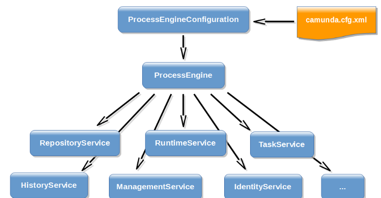
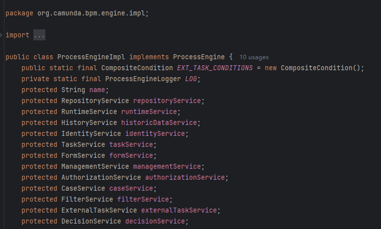

# camunda流程引擎 API 接口介绍

###  **概念**

- **流程（PROCESS）：**  通过工具建模最终生成的BPMN文件，里面有整个流程的定义
- **流程实例（Instance）：** 流程启动后的实例
- **流程变量（Variables）：** 流程任务之间传递的参数
- **任务（TASK）：** 流程中定义的每一个节点
- **流程部署：** 将之前流程定义的.bpmn文件部署到工作流平台

### **核心组件**

- Process Engine-流程引擎
- Web Applicatons-web应用：基于web的管理页面

### **源码地址**

示例代码放到了github上，地址在下面

> https://github.com/ricardo-m-yu/spring-boot-camunda

### **API介绍**

官方文档

> https://docs.camunda.org/manual/7.19/user-guide/process-engine/process-engine-api/

下面是官网的一些文档，有时间可以看看，下面说一些核心的东西。

> 与[流程引擎](https://so.csdn.net/so/search?q=流程引擎&spm=1001.2101.3001.7020)交互最常见的方式就是使用 Java API 。其起点是创建一个流程引擎。有了流程引擎，就可以从中获取各种服务因为提供了工作流和流程管理的方法。流程引擎和服务对象是线程安全的，因此可以为整个服务器保存一个全局的引用。流程引擎的主要 API 如图所示。



#### ProcessEngine

为流程引擎，可以通过他获取相关service，里面集成了很多相关service，默认实现如下：



第一次调用 ProcessEngines.getDefaultProcessEngine (）方法会初始化并返回一个流程引擎的实例，之后的调用则会返回同一个实例。服务 API 引用方式示例，代码如下：

```java
ProcessEngine processEngine = ProcessEngines.getDefaultProcessEngine ();

RepositoryService repositoryService = processEngine.getRepositoryService ();

RuntimeService runtimeService = processEngine.getRuntimeService ();

TaskService taskService = processEngine.getTaskService ();

IdentityService identityService = processEngine.getIdentityService ();

FormService formService = processEngine.getFormService ();

HistoryService historyService = processEngine.getHistoryService ();

ManagementService managementService = processEngine.getManagementService (); 

FilterService filterService = processEngine.getFilterService ();

ExternalTaskService externalTaskService = processEngine.getExternalTaskService ();

CaseService caseService = processEngine.getCaseService ();

DecisionService decisionService = processEngine.getDecisionService ();

```


##### **1. RepositoryService**

当使用 Camunda 引擎的时候， RepositoryService 很可能是第一个需要打交道的服务。这个服务提供了管理和操控流程部署和流程定义的操作方法。其中，流程定义是 BPMN 2.0流程对应的 Java 对象，它代表了流程每一步的结构和行为；而流程部署则是流程引擎中打包流程的单位。一个部署可以包含多个 BPMN 2.0XML文件，以及任何其他资源。开发者可以自行选择什么可以打包在一个部署里面。它既可以是一个单一的 BPMN 2.0 XML 文件，也可以包含整个流程包及其相关的资源。例如，一个 HR 流程部署可以包含与这个流程相关的所有资源。 RepositoryService 可以用来部署这样的包。

部署流程意味着这个部署包会被首先上传到流程引擎，流程引擎会检查并解析所有的流程，然后再存入数据库。从那以后，系统就会知道这个部署，其中包含的流程也就可以开始运行了。

此外， RepositoryService 还允许执行以下操作：

(1）查询流程引擎所知道的部署和流程定义。(2）挂起、激活流程定义。挂起意味着不能进行下一步的流程操作，而激活则是反操作。

(3）获取各种资源，比如部署中包含的文件，或者引擎自动生成的流程图等。


##### **2. RuntimeService**

 RepositoryService 关注的是静态信息，也就是不变的、或者是不经常改变的数据。而 RuntimeService 则相反，它处理的是已启动的流程实例。前面提到过，流程定义定义的是流程中每一步的结构和行为。而流程实例则是上述流程定义的一次执行。对每一个流程定义，通常会有多个流程实例在同时运行。

 RuntimeService 也被用来获取或者存储流程变量。流程变量是特定于流程实例的数据，它可以在流程的各种构造中使用。例如，排他网关通常使用流程变量来决定下一步选取哪一条路径来执行。

 RuntimeService 也被用来查询流程实例和执行（ Execution )。这里面的执行表示的是 BPMN 2.0中令牌（ Token ）的概念。一般来说，一个执行就是一个指向流程实例当前所处位置的一个指针。一个流程实例可以有各种等待状态，而 RuntimeService 则包含各种操作以"通知"流程实例受到了外部触发，因此流程实例可以继续执行了。


##### **3. TaskService**

需要被用户或者系统执行的任务流擎的核心。围着任务的所有资源都被打包在 TaskService 中，例如：

(1）查询分配给用户或组的任务。

(2）创建新的独立任务。这些独立任务是与流程引擎无关的。

(3）控制将任务分配给哪个用户，或者哪些用户，以及以何种方式参与到任务中。

(4）认领并完成一个任务。认领是指某个用户决定承担某个任务，也就是说这个用户会完成这个任务。完成指的是"做完与这个任务相关的工作"。通常，认领并完成任务是在填写某种形式的表单。


##### **4. IdentityService**

 IdentityService 用来管理（创建、更新、删除、查询等）用户和组。需要注意的是，核心引擎在运行时并不做关于用户的任何检查。例如，一个任务可以分配给任意用户，引擎并不会验证系统是否知道这个用户。主要原因是引擎可以与 LDAP 、 Active Directory 等其他服务一起协同工作。相关的检查交由对应的服务来完成。


##### **5. FormService**

 FormService 是可选服务。这就意味着即使没有 FormService , Camunda 引擎也可以在不牺牲任何功能的情况下正常运转。 FormService 引入了开始表单（ Start Form ）和任务表单（ Task Form )。开始表单是在流程开始前显示给用户的表单，而任务表单则是在用户准备要完成任务的时候显示的表单。这些表单都可以在 BPMN 2.0流程中定义。通过 FormService 使得引用这些表单变得更加简单、方便。


##### **6.HistoryService**

 HistoryService 暴露的是流程引擎收集到的所有历史数据。当执行流程的时候，引擎会收集到大量的数据（收集哪些数据是可配的），比如流程实例的开始事件、谁做了某项任务、花了多长时间完成这个任务、流程实例执行经过了哪些路径等。 HistoryService 提供了对这些数据的查询能力。


##### **7.ManagementService**

通常在编写定制化应用时需要用到 ManagementService 。它允许用户获取关于数据库表及其元数据的信息。此外，它还提供了关于作业的查询能力和管理操作。在流程引擎中，作业用途广泛，可用于定时器、异步延续、延迟挂起、激活等。


##### **8. FilterService**

 FilterService 允许创建和管理过滤器。过滤器是像查询任务那样存储起来的查询操作。比如， Tasklist 使用过滤器来过滤用户任务。


##### **9. ExternalTaskService**

 ExternalTaskService 提供对外部任务实例的访问。外部任务表示的是独立于流程引擎并在外部处理的工作单元。


##### **10.CaseService**

 CaseService 跟 runtimeService 类似，只是 CaseService 用于案例实例。其处理与案例相关的工作：比如开始一个新的案例实例、管理案例执行的生命周期等。 CaseService 还用于检索和更新案例实例的流程变量。


##### **11. DecisionService**

 DecisionService 用于评估部署到流程引擎中的决策。它是评估业务规则任务中决策的另外一种替代方法。